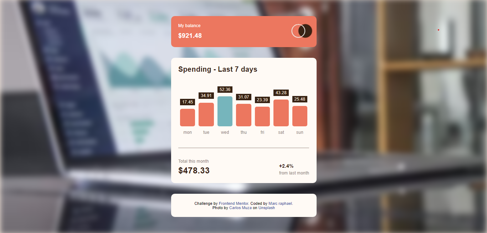

# Frontend Mentor - Expenses chart component solution

This is a solution to the [Expenses chart component challenge on Frontend Mentor](https://www.frontendmentor.io/challenges/expenses-chart-component-e7yJBUdjwt). Frontend Mentor challenges help you improve your coding skills by building realistic projects. 

## Table of contents

- [Overview](#overview)
  - [The challenge](#the-challenge)
  - [Screenshot](#screenshot)
  - [Links](#links)
- [My process](#my-process)
  - [Built with](#built-with)
  - [What I learned](#what-i-learned)
  - [Continued development](#continued-development)
- [Author](#author)

**Note: Delete this note and update the table of contents based on what sections you keep.**

## Overview

### The challenge

Users should be able to:

- View the bar chart and hover over the individual bars to see the correct amounts for each day
- See the current day’s bar highlighted in a different colour to the other bars
- View the optimal layout for the content depending on their device’s screen size
- See hover states for all interactive elements on the page
- **Bonus**: Use the JSON data file provided to dynamically size the bars on the chart

### Screenshot



### Links

- Solution URL: [see solution](https://www.frontendmentor.io/solutions/expenses-chart-component-solution-NKQFWOlNvk)
- Live Site URL: [see live]( https://marcraphael12.github.io/expenses-chart-component-main/)

## My process

### Built with

- Semantic HTML5 markup
- CSS custom properties
- SCSS variables
- Flexbox
- Mobile-first workflow
- JavaScript DOM manipulation
- JSON data file

### What I learned

To day's challenge was a great was to learn how to use the JSON data file to dynamically output a content with DOM manipulation. Also, I learned how to map datas to avoid repeating the same code.

```html
<h1>Some HTML code I'm proud of</h1>
```
```js
const add_days = (data) => {
	const fund = document.createElement("p");
	fund.style.height = (data.amount + 30) + "px";

	// Find the max amount
	const max = Math.max(...Datas.map(data => data.amount));

	if (data.amount === max) {
		fund.style.backgroundColor = `hsl(186, 34%, 60%)`;
	}

	// the block that shows the amount when hover on graph
	const pop = document.createElement("div");
	pop.classList.add("pop");
	pop.innerHTML = `${data.amount}`;
 	fund.addEventListener ('mouseover', function() {
		pop.style.display = "flex";
	})

	fund.classList.add("bar");
	return (`<li class="day">
	${pop.outerHTML}
	${fund.outerHTML}
	<span>${data.day}</span>
	</li>`)
}

```

### Continued development
- JS Mouse events
- JS JSON data file
- JS DOM manipulation
- SCSS variables & functions

## Author
- Frontend Mentor - [@Marcraphael12](https://www.frontendmentor.io/profile/Marcraphael12)